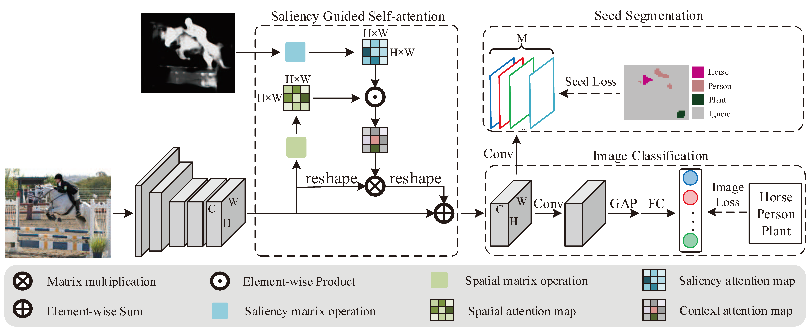

# Saliency Guided Self-attention Network for Weakly and Semi-supervised Semantic Segmentation (IEEE ACCESS)
This code is a implementation of the high-quality seed generation step in the paper [SGAN](https://arxiv.org/abs/1910.05475). The code is developed based on the Pytorch framework.

## Introduction

The proposed approach consists of three components: (1) a CNN backbone to learn deep feature representations; (2) a saliency guided self-attention module that propagates attentions from small discriminative parts to non-discriminative regions; (3) an image classification branch and a seed segmentation branch to supervise the training of the entire network.

## Installation
### 1. Prerequisites
Tested on Ubuntu16.04, CUDA9.0, python3.5, Pytorch 0.4.1, NVIDIA RTX 2080TI

### 2. Dataset
1. Download the prepared [VOC2012 dataset](https://drive.google.com/open?id=1PDTEuTnWJZNWogxYdqYGOlEZHK8dYET9), it contains all the files to reproduce the paper's results, including training images, pre-computed saliency maps and initial seeds.
2. modify the "dataset_root" variable in config file correspondingly.

### 3. models
1. Download [vgg_init.pth](https://drive.google.com/open?id=1lsr7Btwx_1bmc4T2QufLqjojuthOEYuM) model for initializing the SGAN network.
2. You can also download the trained SGAN model [model_iter_8000.pth](https://drive.google.com/open?id=193iExmZcxT7hkpVH4Pgo3KI2gkM_0MF8) for seed generation.

## Usage
### 1. train SGAN network
```bash
CUDA_VISIBLE_DEVICES=0,1 python tools/stage2/train_sgan.py  --cfg_file config/sgan_vgg16_321x321.yml
```

### 2. generate high-quality seeds
```bash
CUDA_VISIBLE_DEVICES=0 python tools/stage2/infer_cam.py --cfg_file config/sgan_vgg16_321x321.yml
```

### 3. (optionally) evaluate the seed quality
```bash
python tools/eval_mIoU.py --res_path [seed_path] --num_classes 22
```

## Seed Result
If you have finished all the steps above, you will get the seeds with precision=76.38 recall=57.26. The result is slightly different with that reported in our paper(precision=76.37, recall=57.35) since this repo is seperated from a larger project and the code may be slighted modified.

The pre-computed seeds can be downloaded [here](https://drive.google.com/open?id=10AU1YOsC8un99AeszM9UHbth3agV3IT5).

## Segmentation Result
If you want to reproduce our segmentation results, please refer [DSRG](https://github.com/speedinghzl/DSRG) to train segmentation network with the generated seeds. We provide the training prototxt [here](https://drive.google.com/open?id=1JTwg5GmcCmTd6FDCeLkCo8ZQ7P7PPmB-) for reference.

## License
SGAN is released under the MIT license

## Citing SGAN
if you find SGAN useful in your research, please consider citing:
```txt
@article{yao2020saliency,
  title={Saliency Guided Self-Attention Network for Weakly and Semi-Supervised Semantic Segmentation},
  author={Yao, Qi and Gong, Xiaojin},
  journal={IEEE Access},
  volume={8},
  pages={14413--14423},
  year={2020},
  publisher={IEEE}
}
```

if you also use the SNet to generate saliency maps, please consider citing:
```txt
@article{xiao2018deep,
  title={Deep salient object detection with dense connections and distraction diagnosis},
  author={Xiao, Huaxin and Feng, Jiashi and Wei, Yunchao and Zhang, Maojun and Yan, Shuicheng},
  journal={IEEE Transactions on Multimedia},
  volume={20},
  number={12},
  pages={3239--3251},
  year={2018},
  publisher={IEEE}
}
```
